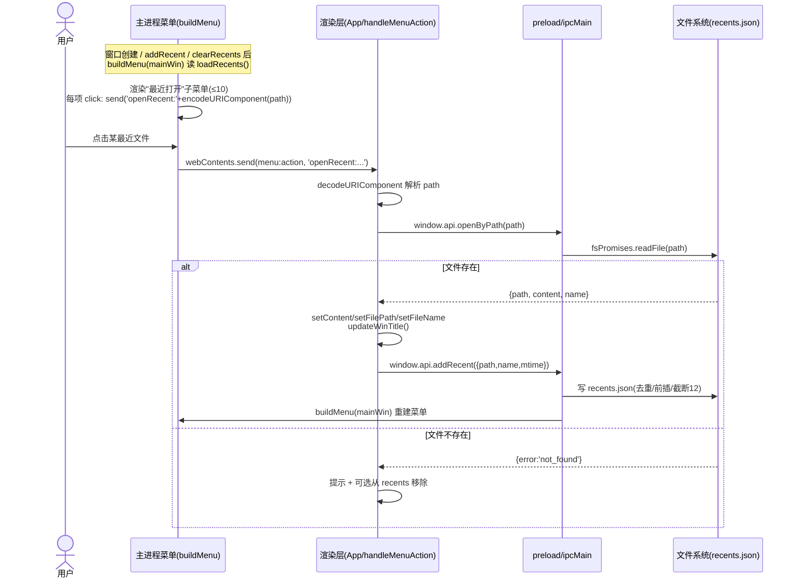
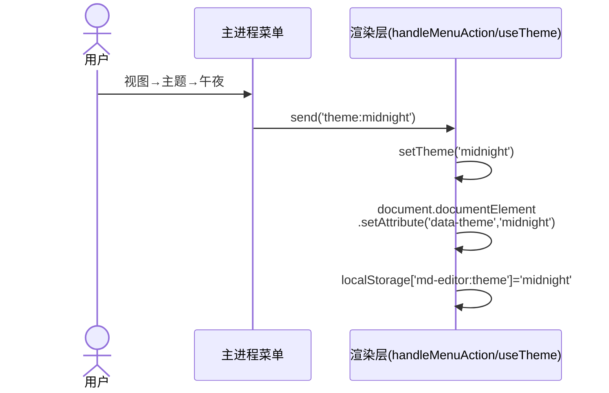
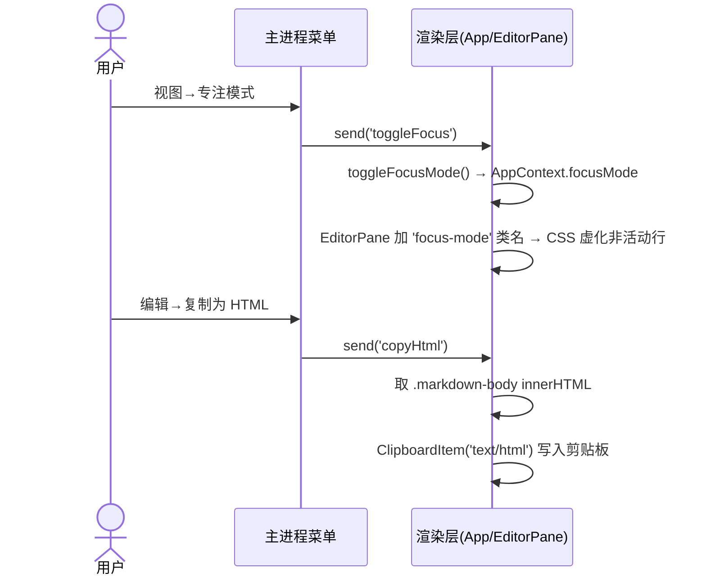

# 增量架构设计 + 任务分解 —— MD-Editor v1.1（改名 `MD-Editor-HY3-YiQi`）

> 架构师：高见远（Gao）
> 日期：2026-08-06
> 输入：`docs/increment-prd.md`（许清楚）、`docs/research-typora-style.md`、现有源码全量对齐
> 范围：**严格遵循主理人拍板范围**（IN 9 项 P0/P1；OUT 仅记录）

---

## 一、实现方案概述 + 框架/依赖选型

### 1.1 总体原则
保持现有架构 **Electron 31 + Vite 5 + React 18 + react-markdown + CodeMirror 6（双栏实时预览）** 不变，本轮为**纯增量**：不引入新框架、不改变现有导出/渲染管线。所有新能力均挂在现有扩展点或新增 IPC 上，确保可独立验证（IPC/类型先行，UI 在后）。

### 1.2 逐项技术选型与核实结论

| # | 能力 | 方案 | 新依赖 | 核实结论 |
| --- | --- | --- | --- | --- |
| ① | 最近打开菜单 | 主进程持有 `mainWin`；`buildMenu(win)` 从 `loadRecents()` 读并渲染子菜单；`addRecent`/`clearRecents` handler 末尾 `buildMenu(mainWin)` 重建；菜单项发 `openRecent:<encodeURIComponent(path)>` 动作；渲染层解析后调新增 `file:openByPath` 打开 | 无 | 主进程已有 `getRecents/addRecent/clearRecents` + `recents.json`（上限 12），缺口仅为"菜单未展示 + 无按路径打开 IPC + 重建机制"，方案见 §四 |
| ② | 全量改名 | 9 处纯文本替换 + 窗口标题动态化 `文件名 — MD-Editor-HY3-YiQi`（`win.setTitle`）+ 关于框升级模态框；品牌名/版本集中到新增 `src/shared/constants.ts` | 无 | `appId: com.mdeditor.app` **保持不变**（主理人裁决）；`package.json` name 改 `md-editor-hy3-yiqi` |
| ③ | 图片拖拽入编辑器 | `App.handleDrop` 扩展图片分支，复用现有 `saveImage` IPC（`mdDir` 取当前文件目录），插入 `` | 无 | `saveImage` 已支持 `mdDir` 相对路径落盘，零改动复用 |
| ④ | 专注模式 Focus | 视图菜单开关 → 渲染层 `focusMode` 状态 → EditorPane 加 `focus-mode` 类名 → CSS 按"行"粒度虚化非活动行（`opacity`）；依赖 CodeMirror 默认 `highlightActiveLine` 产生的 `.cm-activeLine` 类 | 无 | 纯 CSS + 光标行类名，无新依赖 |
| ⑤ | 打字机模式 Typewriter | 视图菜单开关 → 渲染层 `typewriterMode` 状态 → EditorPane 监听光标变化（`EditorView.updateListener`）→ 滚动补偿使活动行垂直居中（仅编辑区滚动容器，预览不受影响） | 无 | 纯 JS 滚动补偿，无新依赖 |
| ⑥ | 自动配对括号 | `EditorPane` extensions 显式加入 `closeBrackets()` + `closeBracketsKeymap`（来自 `@codemirror/autocomplete`） | 建议显式加 `@codemirror/autocomplete` | **关键核实**：`@codemirror/autocomplete` 已在 `node_modules` 中（经 `@uiw/react-codemirror` 传递依赖）；且 `@uiw/react-codemirror` 默认 `basicSetup` 已含 `closeBrackets`/`closeBracketsKeymap`（当前 `basicSetup={{lineNumbers:true,foldGutter:true}}` 仅覆盖两项，其余保持默认 `true`）。故自动配对**很可能已默认生效**；为明确意图、杜绝默认漂移，仍建议显式引入并加入 extensions，并把 `@codemirror/autocomplete` 显式写入 `dependencies` |
| ⑦ | 复制为 HTML | 编辑菜单"复制为 HTML" → 取 `.markdown-body` `innerHTML` → `navigator.clipboard.write([new ClipboardItem({'text/html': new Blob([html],{type:'text/html'})})])` | 无 | 浏览器 Clipboard API，Electron 渲染进程可用；建议附 `text/plain` 回退提升外部兼容性 |
| ⑧ | 更多内置主题（2–3 套） | 基于现有 CSS 变量新增 `paper/graphite/midnight` 三套；视图→主题子菜单切换；枚举 `THEME_LIST` 与 `ThemeName` 集中定义；持久化沿用 `localStorage` 键 `md-editor:theme` | 无 | 仅 CSS 变量 + 1 个枚举，无新依赖 |
| — | 关于框升级 | `alert()` 替换为符合明暗主题的 React 模态框组件（复用现有 CSS 变量，无 MUI） | 无 | 现有项目用纯 CSS 主题体系，不引入 MUI，组件直接复用 `--bg/--fg/--border/--accent` 等变量 |

> **OUT（本轮不做，仅记录）**：导出 Word/ODT（需 `html-docx-js`，用户未明确要求）、导出 PNG、P2 全部（文件树/表格工具栏/拼写检查/大纲折叠/阅读时间/快速打开）。

---

## 二、文件列表及相对路径（本次新增/修改，逐文件改动点）

> 路径相对项目根 `md-editor/`。`[新]` = 新增文件。

### 2.1 契约与配置层
- **`src/shared/constants.ts`** `[新]` — 集中常量：`APP_NAME='MD-Editor-HY3-YiQi'`、`APP_VERSION`（手动维护，渲染层无法访问 `process`）、`THEME_LIST: {key,label}[]`（`light/dark/paper/graphite/midnight`）。主进程与渲染层共享，消除改名魔法字符串与主题枚举重复。
- **`src/shared/ipcChannels.ts`** — `IPC` 增加 `openByPath:'file:openByPath'`、`setTitle:'win:setTitle'`；`MenuAction` 扩展：新增静态 `'toggleFocus' | 'toggleTypewriter' | 'copyHtml'`，并新增模板字面量 `'openRecent:'+string` 与 `'theme:'+string`（动态前缀走 `handleMenuAction` 解析）。
- **`src/shared/types.ts`** — `ElectronAPI` 增加 `openByPath(path:string)=>Promise<OpenFileResult|{error:'not_found'}>`、`setTitle(title:string)=>Promise<void>`；新增类型 `ThemeName = 'light'|'dark'|'paper'|'graphite'|'midnight'`；`OpenFileResult` 复用。
- **`src/main/preload.ts`** — 白名单暴露 `openByPath`、`setTitle`（按现有 `ipcRenderer.invoke` 模式登记）。
- **`package.json`** — `name` → `md-editor-hy3-yiqi`（#9）；`dependencies` 显式追加 `@codemirror/autocomplete`（#⑥ 确定性保证）。
- **`index.html`** — `<title>` → `MD-Editor-HY3-YiQi`（#2）。
- **`electron-builder.yml`** — `productName`→`MD-Editor-HY3-YiQi`（#3）；`portable.artifactName`→`MD-Editor-HY3-YiQi-Portable-${version}.${ext}`（#4）；`nsis.artifactName`→`MD-Editor-HY3-YiQi-Setup-${version}.${ext}`（#5）；`nsis.shortcutName`→`MD-Editor-HY3-YiQi`（#6）。`appId` 不变。

### 2.2 主进程层
- **`src/main/main.ts`** — 模块级持有 `mainWin`；`createWindow` 默认 `title` 用 `APP_NAME`（#1）；`buildMenu(win)` 改造：文件子菜单"另存为"后插入分隔线 + "最近打开"子菜单（读 `loadRecents()` 取 ≤10 条，每项 label=文件名、副标题=路径，含"清空最近打开"项）+ 分隔线；视图子菜单加"专注模式/打字机模式"项（发 `toggleFocus`/`toggleTypewriter`）+ "主题"子菜单（遍历 `THEME_LIST` 发 `theme:<key>`）；编辑子菜单加"复制为 HTML"（发 `copyHtml`）；菜单项 `openRecent` 用 `send('openRecent:'+encodeURIComponent(path))`。新增 `openByPath` handler（按绝对路径 `fsPromises.readFile`，存在返回 `{path,content,name}`，不存在返回 `{error:'not_found'}`）；新增 `setTitle` handler（`mainWin.setTitle`）；`addRecent`/`clearRecents` handler 末尾调用 `buildMenu(mainWin)` 重建菜单。

### 2.3 渲染层
- **`src/renderer/AppContext.tsx`** — `AppState.theme` 类型由 `'light'|'dark'` 改为 `ThemeName`；新增 `setTheme(name:ThemeName)=>void`、`focusMode:boolean`、`typewriterMode:boolean`、`toggleFocusMode()=>void`、`toggleTypewriterMode()=>void`。
- **`src/renderer/hooks.ts`** — `useTheme`：`theme` 类型改 `ThemeName`；`setTheme(name)` 直接设置（写 `data-theme` + `localStorage`）；`toggleTheme` 改为在 `THEME_LIST` 中循环切换（保留 Ctrl+T 行为）。新增可选 `useViewMode` 或直接在 `App` 用 `useState` 管理 `focusMode`/`typewriterMode`（本期不强制持久化，可选 `localStorage` 键 `md-editor:focus`/`md-editor:typewriter`）。
- **`src/renderer/App.tsx`** — ① 欢迎语模板改用 `APP_NAME`（#7）；② `handleMenuAction` 新增分支：`toggleFocus`→`toggleFocusMode()`、`toggleTypewriter`→`toggleTypewriterMode()`、`copyHtml`→复制 `.markdown-body` innerHTML 到剪贴板；解析前缀 `openRecent:`（`decodeURIComponent` 后调 `openByPath`）与 `theme:`（调 `setTheme`）；③ 新增 `openByPath` 包装：成功后 `setContent/setFilePath/setFileName/add recent/setTitle`；④ `handleDrop` 扩展：先判图片（`file.type.startsWith('image/')` 或扩展名）走图片分支（复用 `saveImage`，`mdDir`=当前文件目录，插入 ``），否则走现有 `.md` 分支；**修正** `.md` 分支用 `file.path`（绝对路径）写入 recents（原误用 `file.name`）；⑤ 统一 `updateWinTitle()`：在 `openFile/openByPath/saveFile/saveAs/newFile/handleDrop` 后调 `window.api.setTitle(fileName+' — '+APP_NAME)`；⑥ `about` 动作改为设置 `aboutOpen=true`（渲染 `AboutDialog`）。
- **`src/renderer/components/EditorPane.tsx`** — extensions 加入 `closeBrackets()` + `closeBracketsKeymap`（#⑥）；依据 `focusMode` 给外层 `.editor-pane` 加 `focus-mode` 类名；依据 `typewriterMode` 在 `onCreateEditor` 注册 `EditorView.updateListener`，光标变化时计算活动行位置并将编辑区滚动容器（`scrollDOM`）`scrollTop` 补偿至活动行垂直居中（仅影响编辑区，预览不变）。
- **`src/renderer/components/StatusBar.tsx`** — 在现有状态项后追加 `focusMode`/`typewriterMode` 指示图标（如 `F`/`T` 或文字标签）。
- **`src/renderer/components/TopBar.tsx`** — 主题切换按钮显示**当前主题名 + 图标**（原仅明暗二元判断改为取 `theme` 当前值文案），点击仍 `toggleTheme`。
- **`src/renderer/components/AboutDialog.tsx`** `[新]` — 明暗主题兼容模态框：卡片式遮罩 + 居中面板，展示 `APP_NAME`、`APP_VERSION`、简介、技术栈（Electron + React + CodeMirror 6）、官网/仓库占位链接；关闭按钮/点击遮罩关闭。

### 2.4 样式层
- **`src/renderer/styles/index.css`** — 新增 `[data-theme='paper'/'graphite'/'midnight']` 变量集（复用 `--bg/--fg/--panel-bg/--border/--accent/--accent-fg/--code-bg/--muted/--hover`）；新增 `.focus-mode .cm-content .cm-line{opacity:.35;transition:opacity .2s}` 与 `.focus-mode .cm-content .cm-activeLine{opacity:1}`；新增 `.about-overlay` / `.about-card` 等模态框样式（用现有变量）；新增状态栏模式指示样式。

---

## 三、任务列表（有序、含依赖、按实现顺序）

> 设计原则：IPC/类型/契约先行（T1）→ 主进程菜单与文件 IPC（T2）→ 渲染层接线（T3）→ 样式与主题（T4）→ 关于框模态框（T5）。每个任务可独立验证（`npm run typecheck` / 启动 dev 验证对应能力）。
> 说明：T2（`main.ts`）、T4（`index.css`）为主/渲染各自的**单一核心文件**，属清晰的层边界，故按层单独成任务（T3 已含多文件满足分组粒度）。

### T01 — 契约与配置基础层（IPC / 类型 / preload / 共享常量 + 构建配置改名）
- **文件**：`src/shared/constants.ts`[新]、`src/shared/ipcChannels.ts`、`src/shared/types.ts`、`src/main/preload.ts`、`package.json`、`index.html`、`electron-builder.yml`
- **改动摘要**：建立全部新增 IPC 通道与 `MenuAction` 扩展、新增 `ElectronAPI.openByPath/setTitle`、`ThemeName` 类型、集中常量 `APP_NAME/APP_VERSION/THEME_LIST`；完成构建侧改名（#2/#3/#4/#5/#6/#9）+ 显式加 `@codemirror/autocomplete` 依赖。
- **依赖前置**：无（本轮基础）
- **优先级**：P0
- **验收**：`npm run typecheck` 通过；`npm run dev` 打包无未定义引用。

### T02 — 主进程菜单与文件打开 IPC（`main.ts`）
- **文件**：`src/main/main.ts`
- **改动摘要**：持有 `mainWin`；`buildMenu(win)` 渲染"最近打开"子菜单（≤10 + 清空项）、"主题"子菜单（遍历 `THEME_LIST`）、"专注/打字机/复制为 HTML"菜单项；`addRecent`/`clearRecents` 末尾重建菜单；新增 `openByPath`、`setTitle` handler；默认窗口标题用 `APP_NAME`。
- **依赖前置**：T01
- **优先级**：P0
- **验收**：启动后菜单出现"最近打开"（含清空）、主题子菜单；打开文件后菜单"最近打开"出现新条目。

### T03 — 渲染层核心接线（App / hooks / context / EditorPane / StatusBar / TopBar）
- **文件**：`src/renderer/App.tsx`、`src/renderer/hooks.ts`、`src/renderer/AppContext.tsx`、`src/renderer/components/EditorPane.tsx`、`src/renderer/components/StatusBar.tsx`、`src/renderer/components/TopBar.tsx`
- **改动摘要**：`AppContext`/`useTheme` 升级为 `ThemeName` + `setTheme` + 专注/打字机状态；`App` 接线 `openRecent:`/`theme:` 前缀解析、`copyHtml`、图片拖拽分支、`handleDrop` 绝对路径修正、`setTitle` 动态标题、`about` 开模态；`EditorPane` 加 `closeBrackets()`+`closeBracketsKeymap`、`focus-mode` 类名、打字机滚动补偿；`StatusBar` 模式指示；`TopBar` 显示当前主题名；欢迎语改 `APP_NAME`（#7）。
- **依赖前置**：T01、T02
- **优先级**：P0（改名/最近打开/图片拖拽/专注/打字机）+ P1（括号/复制HTML/主题切换接线）
- **验收**：最近打开可点开、图片可拖入、专注/打字机可开关且视觉正确、括号自动配对、复制为 HTML 可粘贴到外部、主题子菜单切换生效。

### T04 — 样式与主题体系（CSS）
- **文件**：`src/renderer/styles/index.css`
- **改动摘要**：新增 `paper/graphite/midnight` 三套 `[data-theme]` 变量集；`focus-mode` 非活动行虚化样式；状态栏模式指示样式。
- **依赖前置**：T01（依赖 `THEME_LIST` 键名约定）
- **优先级**：P1
- **验收**：视图→主题切换后三套新主题配色正确、明暗对比达标；专注模式虚化生效。

### T05 — 关于框模态框（AboutDialog）
- **文件**：`src/renderer/components/AboutDialog.tsx`[新]、`src/renderer/App.tsx`（渲染接入，已在 T03 埋 `aboutOpen` 状态）
- **改动摘要**：实现明暗兼容模态框组件，展示品牌名/版本/简介/技术栈/占位链接；`App` 在 `aboutOpen` 时渲染并传入关闭回调（#8 升级）。
- **依赖前置**：T01（用 `APP_NAME/APP_VERSION`）、T03（`aboutOpen` 状态）
- **优先级**：P0（改名收口）
- **验收**：帮助→关于弹出正式模态框，明暗主题下样式正确，关闭正常。

---

## 四、跨文件共享约定

1. **新增 IPC 通道**（唯一来源 `src/shared/ipcChannels.ts`）：
   - `IPC.openByPath = 'file:openByPath'`
   - `IPC.setTitle = 'win:setTitle'`
2. **`MenuAction` 扩展约定**：
   - 静态新增：`'toggleFocus' | 'toggleTypewriter' | 'copyHtml'`
   - 动态前缀（渲染层 `handleMenuAction` 做 `startsWith` 解析）：
     - `openRecent:<encodeURIComponent(path)>` —— 点击最近打开条目
     - `theme:<key>` —— `key ∈ THEME_LIST` 的 `key`
   - 其余原有动作保持不变。
3. **`ElectronAPI` 新增方法签名**：
   - `openByPath(path: string): Promise<OpenFileResult | { error: 'not_found' }>`
   - `setTitle(title: string): Promise<void>`
4. **主题枚举定义位置**：
   - 类型 `ThemeName` 在 `src/shared/types.ts`；
   - 枚举与中文标签 `THEME_LIST: {key:ThemeName,label:string}[]`（`light/dark/paper/graphite/midnight`）在 `src/shared/constants.ts`，主进程（菜单子菜单）与渲染层（切换/持久化）**共用同一份**；
   - `data-theme` 取值 = `key`；持久化键沿用 `localStorage['md-editor:theme']`（存 `key`）。
5. **recents 路径编码方式**：菜单侧 `encodeURIComponent(path)` 拼在 `openRecent:` 后；渲染侧 `decodeURIComponent(action.slice('openRecent:'.length))` 还原绝对路径。
6. **品牌名/版本集中常量**（`src/shared/constants.ts`）：`APP_NAME`、`APP_VERSION`；窗口标题格式统一为 `` `${fileName} — ${APP_NAME}` ``（em dash）。
7. **专注/打字机状态**：仅渲染层 React 状态（经 `AppContext` 下发 `EditorPane`/`StatusBar`），不触发主进程菜单重建；本期不强制持久化（可选 `localStorage` 键 `md-editor:focus`/`md-editor:typewriter`）。
8. **图片拖入约定**：`handleDrop` 检测图片（`type` 以 `image/` 起或扩展名匹配）→ 调 `saveImage(base64FromDrop, name, getDir(filePath))`，插入 ``；`mdDir` 取当前打开文件目录（无则回退 `userData/images`，与粘贴一致）。

---

## 五、程序调用 / 数据流要点（时序图）

### 5.1 最近打开：点击 → openRecent → openByPath → 加载 → addRecent → 菜单重建

### 5.2 主题切换（菜单 → 渲染层）

### 5.3 专注/打字机/复制HTML（菜单 → 渲染层，不触发菜单重建）

---

## 六、待明确事项（仅技术层面）

1. **专注模式依赖 `.cm-activeLine` 类**：首版按行粒度虚化依赖 CodeMirror `highlightActiveLine`（默认 `true`）产生的 `.cm-activeLine`。若某主题/配置关闭了该项需改回；已确认 `@uiw/react-codemirror` 默认开启，仍建议在 `EditorPane` 显式保留 `highlightActiveLine`（属 `basicSetup` 默认）。
2. **打字机滚动补偿实现**：活动行居中的具体计算（用 `view.lineBlockAt` + `scrollDOM.scrollTop` 或 `coordsAtPos` + `scrollIntoView`）由工程师在实现时选定，设计仅定义"光标变化→编辑区滚动使活动行垂直居中、预览不动"的行为契约。
3. **复制为 HTML 是否附 `text/plain` 回退**：建议同时写入 `text/plain`（取 `.markdown-body` `textContent`）以提升粘贴到纯文本目标的兼容性；若不要求可仅 `text/html`。
4. **关于框版本号来源**：渲染层无法访问 `process`，`APP_VERSION` 以 `src/shared/constants.ts` 常量手动维护（与 `package.json` 解耦）。若需自动同步，未来可经 preload 暴露 `getAppVersion`（本轮不引入）。
5. **三套新主题具体色值**：`paper/graphite/midnight` 的 CSS 变量取值本次先给合理默认值（满足对比度/可读性），最终视觉微调可由设计师确认；设计文档不绑定具体色板。
6. **专注/打字机是否持久化**：本期未强制；若希望重启保留，可在 `useTheme` 同级用 `localStorage`（键 `md-editor:focus`/`md-editor:typewriter`），属可选增强。

---

> 附：本设计配套时序图另存于 `docs/sequence-diagram.mermaid`，类/契约关系图存于 `docs/class-diagram.mermaid`。
