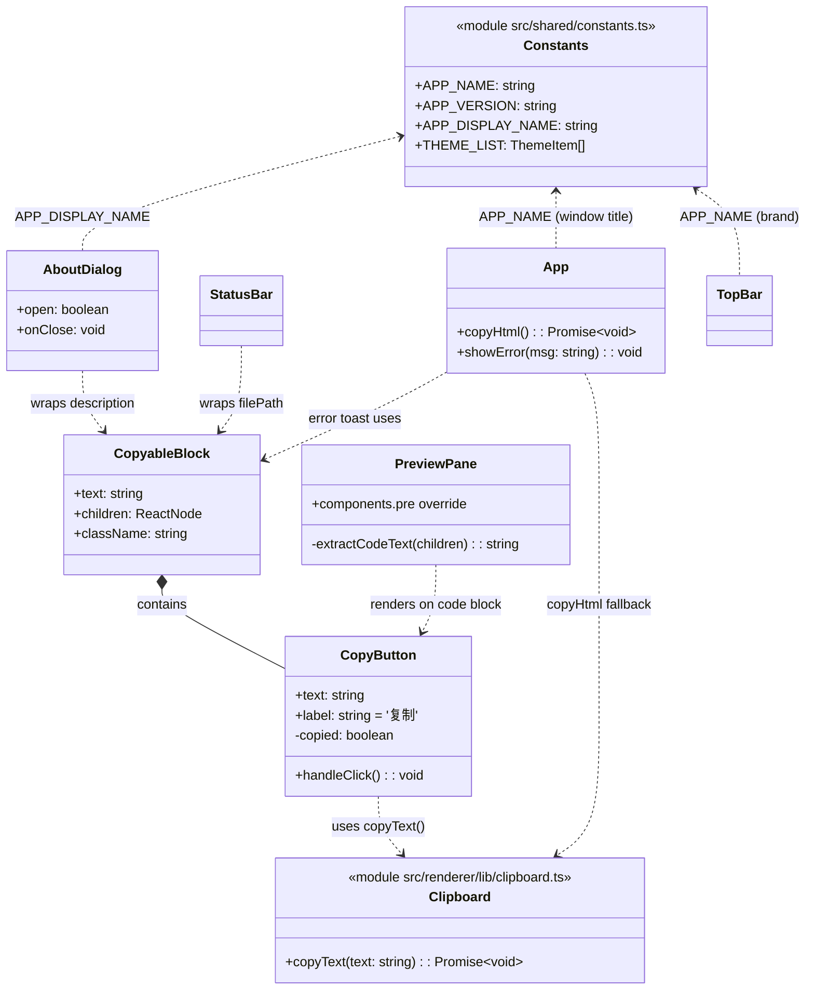
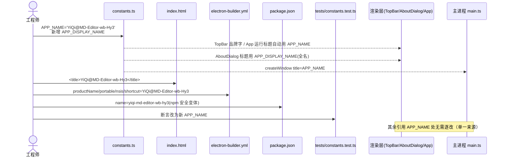
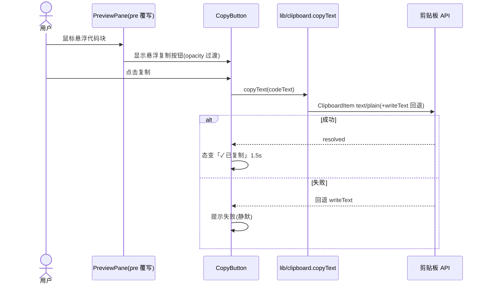
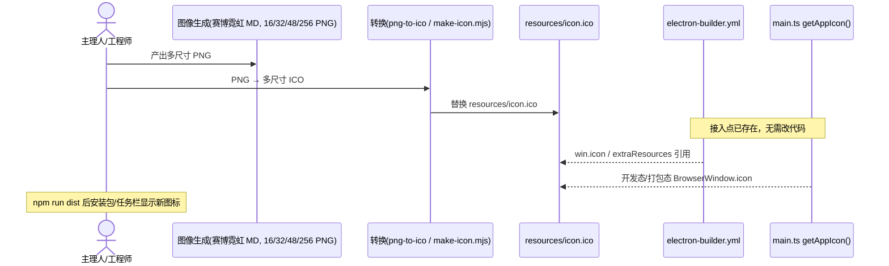
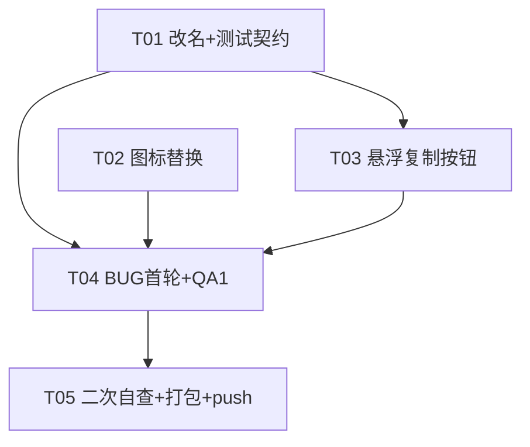

# 增量架构设计 + 任务分解（第二轮）—— MD-Editor 改名 / 图标 / 悬浮复制 / BUG

> 架构师：高见远（Gao）
> 日期：2026-08-07
> 输入：`docs/increment2-prd.md`（许清楚，本轮 PRD）、`docs/increment-design.md` / `docs/increment-prd.md`（第一轮，已 push，HEAD=89f0fc9）、现有源码全量对齐
> 范围：**严格遵循主理人已确认决策**（改名保留 `@`、悬浮复制仅覆盖预览代码块 + 只读文本块、图标赛博霓虹 MD 风格多尺寸、git 统一由主理人 push）。第一轮已交付能力保持不变，本设计为纯增量。

---

## 一、实现方案与框架选型

### 1.1 总体原则
保持现有架构 **Electron 31 + Vite 5 + React 18 + TypeScript + react-markdown + CodeMirror 6（双栏实时预览）+ 纯 CSS 主题（CSS 变量 + `[data-theme]`）** 不变。**不引入任何新运行时依赖**，悬浮复制按钮用纯 DOM/CSS + 已有 Clipboard 逻辑实现，图标由主理人/工程师用图像生成后转 `.ico`（代码接入点已存在，零代码改动）。

### 1.2 逐项技术选型

| # | 能力 | 方案 | 新依赖 | 结论 |
| --- | --- | --- | --- | --- |
| ① | 品牌全量重命名 | 单一来源 `src/shared/constants.ts` 改 `APP_NAME`；新增派生常量 `APP_DISPLAY_NAME`（关于框/安装包/快捷方式用全名）；`index.html` / `electron-builder.yml` / `package.json` / `tests/constants.test.ts` 字面量同步；渲染层 `TopBar` 品牌字、`AboutDialog`、`App` 运行标题、主进程 `main.ts` 标题因引用 `APP_NAME` **自动生效** | 无 | 纯文本替换 + 测试契约同步；`appId: com.mdeditor.app` 保持不变（避免影响已装版本更新标识） |
| ② | 应用图标多尺寸重设计 | 替换 `resources/icon.ico`（真·多尺寸 16/32/48/256，赛博霓虹 MD 风格）；`electron-builder.yml` `win.icon` / `extraResources`、`main.ts` `getAppIcon()` 接入点已存在，**无需改代码**，仅换文件 | 无（或可选 `png-to-ico` 轻量 devDep 用于 PNG→ICO 转换） | 代码零改；图标为二进制交付物，由主理人/工程师提供 |
| ③ | 悬浮复制按钮 | 新增通用 `CopyButton` + `CopyableBlock` 组件（相对定位容器 + 绝对定位悬浮按钮，纯 CSS + `opacity` 过渡，尊重 `prefers-reduced-motion`）；`PreviewPane` 覆写 `pre` 包裹代码块；`AboutDialog` 描述、`StatusBar` 文件路径、`App` 错误 toast 用 `CopyableBlock`；**复用**已有 `copyHtml` 的剪贴板回退思路，抽公共 `copyText(text)` | 无 | 优先复用已有 clipboard 逻辑；编辑源码区不覆盖（原生复制已完备） |
| ④ | BUG 首轮定位与修复 | vitest 回归 + 代码评审 + 手动验收清单三件套；高风险区见 PRD §4.2（最近打开/主题/图片拖拽/复制HTML/浮动UI/窗口标题/zoom/构建） | 无 | 开放式排查；确定性项：测试契约已在 ① 同步、旧 `dist*` 二进制在 ⑦ 重建 |
| ⑤ | BUG 二次自查 + 回归 | ④ 修复后跑第二遍（vitest + 评审 + 手动清单） | 无 | 不引入新阻断 |
| ⑥ | 重新打包 exe + push | `npm run dist`（沿用 `scripts/do-not-sign.js` 沙箱 workaround）→ `release/` → 归档 `dist-pkg7/`；主理人统一 commit + push 至 `git@github.com:WangXP7/YiQi-MD-Editor.git`（main） | 无 | `.gitignore` 已覆盖 `dist*/release/*.exe`，旧二进制不入库 |

---

## 二、文件列表及相对路径（标注 改 / 增）

> 路径相对项目根 `md-editor/`。`[改]` = 修改，`[增]` = 新增，`[替换]` = 二进制替换。

### 2.1 契约 / 配置 / 构建层（T01 改名 + T02 图标）
- **`src/shared/constants.ts`** `[改]` — `APP_NAME='YiQi@MD-Editor-wb-Hy3'`；新增 `APP_DISPLAY_NAME = APP_NAME + ' v' + APP_VERSION`（=`'YiQi@MD-Editor-wb-Hy3 v1.0.0'`）；`APP_VERSION`/`THEME_LIST` 不变。
- **`index.html`** `[改]` — `<title>` → `YiQi@MD-Editor-wb-Hy3`（基础名）。
- **`electron-builder.yml`** `[改]` — `productName`/`portable.artifactName`/`nsis.artifactName`/`nsis.shortcutName` → `YiQi@MD-Editor-wb-Hy3`（artifactName 模板天然带 `${version}`）；`appId` 不变。
- **`package.json`** `[改]` — `name` → `yiqi-md-editor-wb-hy3`（npm 命名约束：须小写、禁 `@`/大写；非用户可见，详见 §八）。
- **`tests/constants.test.ts`** `[改]` — 第 5–6 行断言改为 `'YiQi@MD-Editor-wb-Hy3'`（不改则 `npm test` 红）。
- **`resources/icon.ico`** `[替换]` — 新赛博霓虹 MD 风格多尺寸（16/32/48/256）ICO。
- **`scripts/make-icon.mjs`** `[改]` — 扩展为从设计师 PNG 源组装多尺寸 ICO（或仅作备用纯 Node 方案；转换也可走 `png-to-ico`）。
- **`index.html`** `[改-T02]` — 可选补 `<link rel="icon" href="icon.ico">` 使 dev tab 也显示新图标（随资源拷贝）。

### 2.2 渲染层（T03 悬浮复制）
- **`src/renderer/lib/clipboard.ts`** `[增]` — `copyText(text: string): Promise<void>`（ClipboardItem `text/plain` + `writeText` 回退），供 `CopyButton` 与 `copyHtml` 复用。
- **`src/renderer/components/CopyButton.tsx`** `[增]` — 悬浮圆形复制按钮，点击 `copyText` + `copied` 态（「✓」1.5s）。
- **`src/renderer/components/CopyableBlock.tsx`** `[增]` — 相对定位包裹容器 + 内嵌 `CopyButton`（用于只读文本块）。
- **`src/renderer/components/PreviewPane.tsx`** `[改]` — `components` 增加 `pre` 覆写：包裹 `.code-block` + `CopyButton`（取代码块文本，含 Mermaid 源码）。
- **`src/renderer/components/AboutDialog.tsx`** `[改]` — 标题用 `APP_DISPLAY_NAME`（全名）；描述段落用 `CopyableBlock` 包裹。
- **`src/renderer/components/StatusBar.tsx`** `[改]` — `filePath` 长文本用 `CopyableBlock` 包裹（仅 `filePath` 非空时）。
- **`src/renderer/App.tsx`** `[改]` — `copyHtml` 复用 `copyText` 做纯文本回退；新增轻量错误 toast（`showError`）用 `CopyableBlock` 承载长错误文案（替换原生 `alert` 长提示）。
- **`src/renderer/styles/index.css`** `[改]` — 新增 `.code-block`/`.copyable-block`/`.copy-btn` 样式（用现有 `--bg/--fg/--panel-bg/--border/--accent` 变量，明/暗及 3 套新主题均可见；`prefers-reduced-motion` 降级）。

> 注：`TopBar.tsx`、`main.ts` 的改名因引用 `APP_NAME` 常量自动生效，无需逐行改（列于 T01 验收，不重复改文件）。

---

## 三、数据结构与接口

### 3.1 类 / 组件关系（mermaid classDiagram）



### 3.2 关键接口说明

**`CopyButton` props**
```ts
interface CopyButtonProps {
  text: string          // 要复制的纯文本
  label?: string        // 无障碍标签，默认 '复制'
  className?: string
}
```
内部状态 `copied: boolean`；点击 → `await copyText(text)` → 置 `copied=true` → 1.5s 后复位；成功态显示 `✓`，失败静默回退。

**`CopyableBlock` props**
```ts
interface CopyableBlockProps {
  text: string          // 长文本原文（用于复制）
  children: React.ReactNode
  className?: string
}
```
渲染 `position:relative` 容器，内容 + 右上角 `CopyButton`；悬浮容器时按钮 `opacity` 1→可见。

**`copyText(text)` —— 与原 `copyHtml` 的关系**
```ts
// src/renderer/lib/clipboard.ts
export async function copyText(text: string): Promise<void> {
  const plain = new Blob([text], { type: 'text/plain' })
  try {
    await navigator.clipboard.write([new ClipboardItem({ 'text/plain': plain })])
  } catch {
    try { await navigator.clipboard.writeText(text) } catch { /* ignore */ }
  }
}
```
- `copyHtml`（现有）改写为：取 `.markdown-body` `innerHTML` + `textContent`，优先 `ClipboardItem({ 'text/html', 'text/plain' })`；**`catch` 分支复用 `copyText(text)`** 做纯文本回退（消除重复逻辑）。
- `CopyButton` 仅写纯文本，直接调用 `copyText`，满足"优先复用已有复制逻辑"。

**`APP_DISPLAY_NAME`（新增派生常量）**
```ts
export const APP_DISPLAY_NAME = `${APP_NAME} v${APP_VERSION}` // 'YiQi@MD-Editor-wb-Hy3 v1.0.0'
```
关于框标题、安装包/桌面快捷方式（由 electron-builder `productName`/`shortcutName` 用基础名 + `artifactName` 模板带版本）显示全名；窗口/运行标题（`updateWinTitle`）与 `TopBar` 用基础名 `APP_NAME`。

---

## 四、程序调用流程（时序图）

### 4.1 改名如何影响各层



### 4.2 悬浮复制按钮交互流（预览代码块）



### 4.3 图标接入流（零代码改动，仅换文件）



---

## 五、有序任务列表（T01..T05，含依赖、按实现顺序、验收）

> 设计约束：任务数 ≤ 5（硬性上限）；按功能/层次分组；T01 为基础设施（配置 + 入口 + 依赖 + 测试契约）。下方 5 个任务覆盖用户建议的 8 个子步骤：
> T01=①改名+测试契约同步 ｜ T02=②图标替换 ｜ T03=③悬浮复制按钮 ｜ T04=④BUG 首轮定位与修复+⑤QA 第1轮 ｜ T05=⑥BUG 第2轮自查+⑦重新打包 exe(dist-pkg7)+⑧主理人 push。

### T01 — 品牌全量重命名 + 测试契约同步（基础设施）
- **目标**：全量改名 `YiQi@MD-Editor-wb-Hy3`（基础名），关于框/安装包显示全名；同步测试断言，避免 `npm test` 红。
- **涉及文件**：`src/shared/constants.ts`[改]、`index.html`[改]、`electron-builder.yml`[改]、`package.json`[改]、`tests/constants.test.ts`[改]
- **依赖前置**：无（本轮基础）
- **优先级**：P0
- **验收**：① `npm run typecheck` 通过；② `npm test` 通过（断言新名）；③ 渲染层 `TopBar` 品牌字、`App` 运行标题、主进程窗口标题均为 `YiQi@MD-Editor-wb-Hy3`；④ `AboutDialog` 标题为 `YiQi@MD-Editor-wb-Hy3 v1.0.0`；⑤ 打包相关 `productName`/`artifactName`/`shortcutName` 已改（构建在 T05 验证）。

### T02 — 应用图标多尺寸替换与接入
- **目标**：用赛博霓虹 MD 风格多尺寸（16/32/48/256）ICO 替换 `resources/icon.ico`；接入点零代码改动；可选补 dev tab favicon。
- **涉及文件**：`resources/icon.ico`[替换]、`scripts/make-icon.mjs`[改-多尺寸]、`index.html`[改-T02 可选 favicon]
- **依赖前置**：无（与 T01 独立，可并行）
- **优先级**：P0
- **验收**：① `resources/icon.ico` 为含 16/32/48/256 的真多尺寸 ICO（非 PNG 改名）；② `electron-builder.yml` `win.icon` / `extraResources` 与 `main.ts` `getAppIcon()` 路径仍正确（无需改）；③ （可选）`index.html` 补 `<link rel="icon">` 后 dev tab 显示新图标。

### T03 — 悬浮复制按钮（预览代码块 + 只读文本块）
- **目标**：实现通用复制组件，覆盖预览代码块、关于框描述、状态栏文件路径、错误 toast；复用 `copyText` 统一剪贴板逻辑；编辑源码区不覆盖。
- **涉及文件**：`src/renderer/lib/clipboard.ts`[增]、`src/renderer/components/CopyButton.tsx`[增]、`src/renderer/components/CopyableBlock.tsx`[增]、`src/renderer/components/PreviewPane.tsx`[改]、`src/renderer/components/AboutDialog.tsx`[改]、`src/renderer/components/StatusBar.tsx`[改]、`src/renderer/App.tsx`[改]、`src/renderer/styles/index.css`[改]
- **依赖前置**：T01（常量稳定；`AboutDialog`/`App`/`StatusBar` 在 T01 后编辑避免冲突）
- **优先级**：P1
- **验收**：① 鼠标悬浮预览代码块右上角浮现 📋，点击复制纯文本成功、显示 ✓ 反馈；② 关于框描述、状态栏文件路径悬浮可复制；③ 长错误提示经 toast 可复制；④ 明/暗及 3 套新主题下按钮清晰可见、不遮挡原文；⑤ `copyHtml` 仍可用且回退复用 `copyText`；⑥ `npm test` / `npm run typecheck` 通过。

### T04 — BUG 首轮定位与修复 + QA 第1轮
- **目标**：开放式排查高风险区（最近打开/clearRecents、主题切换、图片拖拽、复制HTML、浮动 UI、窗口标题、zoom、自动保存草稿），修复并跑首轮 QA。
- **涉及文件（候选，定位后落定）**：`src/main/main.ts`、`src/renderer/App.tsx`、`src/renderer/hooks.ts`、`src/renderer/components/EditorPane.tsx`、`src/renderer/components/PreviewPane.tsx`、`src/renderer/styles/index.css`
- **依赖前置**：T01、T02、T03（全部功能就位后回归）
- **优先级**：P0（定位修复）+ P1（QA1）
- **验收**：① `npm test` 全绿；② 高风险区手动清单走查无阻断；③ 不破坏第一轮能力（最近打开/专注打字机/括号配对/复制HTML/3 主题/图片拖拽）；④ 修复点有最小回归覆盖。

### T05 — BUG 第2轮自查 + 重新打包 exe（dist-pkg7）+ 主理人 push
- **目标**：修复后二次自查 + 回归；重新构建发布包（沿用沙箱 workaround）；主理人统一 commit + push main。
- **涉及文件（验证/产物）**：`electron-builder.yml`[验证 artifactName 含 @/版本]、`.gitignore`[验证 dist*/release/*.exe 忽略]、`release/`（构建产物）、`dist-pkg7/`（归档）、`scripts/do-not-sign.js`（沿用）
- **依赖前置**：T04
- **优先级**：P0（发布闸门）
- **验收**：① 二次自查无新增阻断；② `npm run dist` 成功，产出 `YiQi@MD-Editor-wb-Hy3-Portable-1.0.0.exe` / `YiQi@MD-Editor-wb-Hy3-Setup-1.0.0.exe`，图标为新风；③ `@` 在 NSIS 打包/快捷方式/卸载项无异常（若异常按 §八 退化方案处理）；④ 主理人 commit + push 至 `git@github.com:WangXP7/YiQi-MD-Editor.git`（main），旧 `dist*/` 二进制未入库。

### 5.1 任务依赖图（mermaid）



> 说明：T02 与 T01/T03 均无代码依赖，可并行；T03 因与 T01 共用 `AboutDialog`/`App`/`StatusBar` 文件，排在 T01 之后顺序执行；T04/T05 为质量闸门线性收口。

---

## 六、依赖包列表

- **运行时依赖**：无新增（零新依赖）。
- **开发依赖**：无强制新增。
  - 可选：`png-to-ico`（轻量，≈10KB）——仅用于将设计师 PNG 转换为多尺寸 `.ico`；若改用现有纯 Node `scripts/make-icon.mjs` 或系统 `icotool`/`ImageMagick convert`，则**完全无需新增依赖**。
- **图标交付**：由主理人/工程师用图像生成产出多尺寸 PNG，再转 `.ico`；代码侧接入点已存在，不引入依赖。

---

## 七、跨文件约定

1. **品牌名单一来源**：`APP_NAME`（基础名，无版本）与 `APP_DISPLAY_NAME`（全名 `APP_NAME vAPP_VERSION`）集中 `src/shared/constants.ts`；渲染层无法访问 `process`，故 `APP_VERSION` 手动维护。
2. **显示名 vs 文件名均保留 `@`**：所有用户可见字符串（`TopBar`/`AboutDialog`/窗口标题/`index.html`/安装包名/快捷方式名/exe 文件名模板）保留 `@` 与大小写；仅 `package.json` `name`（npm 内部标识、非用户可见）因 npm 约束用 `yiqi-md-editor-wb-hy3`（详见 §八）。
3. **窗口/运行标题用基础名**：`App.updateWinTitle` 维持 `文件名 — APP_NAME`（em dash，不带版本）；`main.ts` `createWindow` `title: APP_NAME`；`AboutDialog` 标题用 `APP_DISPLAY_NAME`（全名）。
4. **复制逻辑复用**：所有复制入口统一经 `src/renderer/lib/clipboard.ts` 的 `copyText`；`copyHtml` 的纯文本回退改为调用 `copyText`（消除重复）。
5. **复制按钮主题兼容**：样式只用现有 CSS 变量（`--bg/--fg/--panel-bg/--border/--accent/--accent-fg/--muted/--hover`），禁止硬编码色值；尊重 `prefers-reduced-motion`。
6. **图标接入点不变**：`electron-builder.yml` `win.icon: resources/icon.ico` + `extraResources`（to icon.ico）、`main.ts` `getAppIcon()` 路径保持；本轮仅替换 `resources/icon.ico` 文件。
7. **测试契约同步**：任何改名必须同步 `tests/constants.test.ts` 断言，否则 `npm test` 失败（已在 T01 覆盖）。
8. **打包沙箱 workaround 沿用**：`electron-builder.yml` `win.sign: ./scripts/do-not-sign.js`（无证书跳过 winCodeSign），本轮不变。

---

## 八、待明确事项（技术层面，需主理人/用户最终确认）

1. **`package.json` `name` 含 `@` 可行性**：npm 命名规则禁止 `@`/大写，故本设计取 `yiqi-md-editor-wb-hy3`（保留新身份、去 `@`/改小写，非用户可见）。若坚持在 `package.json` 也保留 `@`/`YiQi`（接受 `npm install`/发布潜在报错风险），请确认，将同步调整 T01。
2. **图标转换工具**：默认推荐现有纯 Node `scripts/make-icon.mjs` 扩展多尺寸，或 `png-to-ico`（轻量 devDep）。若主理人已用外部工具（如 ImageMagick）生成 `.ico`，则 `scripts/make-icon.mjs` 可不改。
3. **`@` 在 NSIS `artifactName`/`shortcutName` 兼容性**：Windows 文件名允许 `@`，但部分打包工具/杀软敏感。首次 `npm run dist`（T05）必须验证打包不报错、快捷方式/卸载项正常；**若异常**，退化方案：exe 文件名/`shortcutName` 去 `@` 变 `YiQi-MD-Editor-wb-Hy3`，**仅文件名退化为连字符，显示名（关于框/窗口标题/HTML title）仍保留 `@`**。
4. **错误提示复制形态**：现有 `alert()` 无法承载悬浮按钮，本设计改为轻量 toast（`CopyableBlock` 包裹长错误文案）。若用户要求保留原生 `alert`，则"错误提示"复制降级为不提供（仅覆盖预览代码块/关于框/状态栏）。
5. **`appId` 本轮不变**：保持 `com.mdeditor.app`，避免影响已装版本自动更新识别（与第一轮裁决一致）。如需改为 `com.yiqi.md-editor-wb-hy3` 请确认。

---

> 附：本设计时序图另存于 `docs/increment2-sequence.mermaid`，类/组件关系图存于 `docs/increment2-class.mermaid`。
