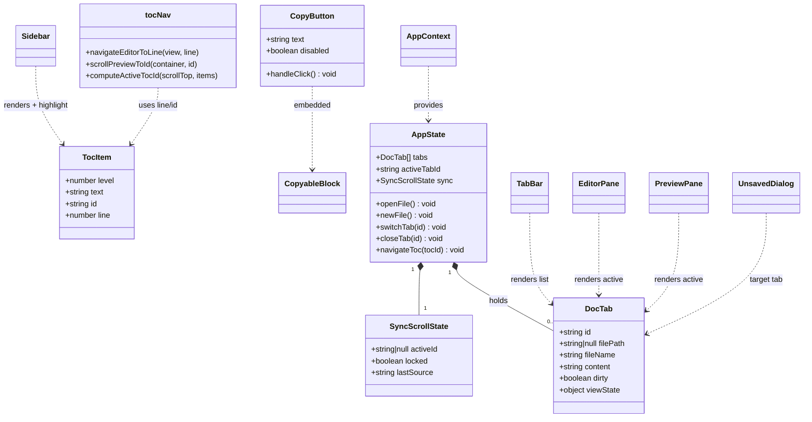
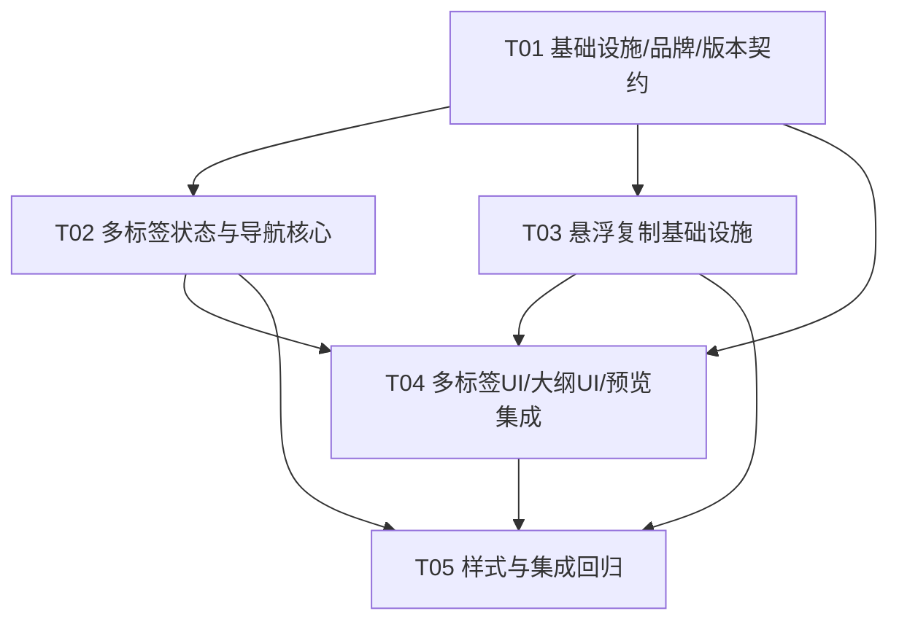

# 增量架构设计 + 任务分解（第三轮）—— 目录大纲联动 / 多标签 / 悬浮复制验证 / 品牌"墨览"

> 架构师：高见远（Gao）
> 日期：2026-08-11
> 输入：`docs/increment3-prd.md`（许清楚，本轮 PRD）、`docs/increment2-design.md` / `docs/increment2-prd.md`（第二轮）、现有源码全量对齐（HEAD 已含 `YiQi@MD-Editor-wb-Hy3` v1.0.0）
> 范围：**严格增量**。前两轮能力（主题、专注/打字机、图片拖拽、最近打开、改名、悬浮复制代码块、导出）保持不变；本设计只描述 5 点新增/修改（① 大纲联动 ② 多标签 ③ 悬浮复制验证兜底 ④ 版本号 ⑤ 品牌"墨览"）。git 统一由主理人 push。

---

## 一、实现方案与框架选型

### 1.1 总体原则

保持现有架构 **Electron 31 + Vite 5 + React 18 + TypeScript + react-markdown 9 + CodeMirror 6（双栏实时预览）+ 纯 CSS 主题（CSS 变量 + `[data-theme]`）** 不变。**本轮不引入任何新的运行时依赖**，所有能力均用已有库 + 原生 API 实现。

### 1.2 逐项技术选型（直接回答 PRD 的两个框架问题）

| # | 能力 | 方案 | 新依赖 | 结论 |
| --- | --- | --- | --- | --- |
| ① | 目录大纲**联动编辑/预览** | 复用现有 `src/renderer/lib/toc.ts`（正则 + `github-slugger`，已被依赖）；**新增 `line` 字段**记录标题源码行号；编辑区用 CodeMirror `EditorView` 定位行，预览区用 `rehype-slug` 生成的 `id` 锚点（`id` 算法与 `github-slugger` 完全一致，现有 `Sidebar` 已验证） | **无** | 解析零新增依赖；仅需给 `TocItem` 加 `line` 并补全「点击→编辑区光标 + 预览区滚动」双向联动 + 滚动高亮（scroll-spy） |
| ② | 多标签状态管理 | **采用 React Context**（扩展现有 `AppContext`，把单文档状态重构为 `DocTab[]` + `activeTabId`） | **无** | **答复 PRD「Context 还是 Zustand」：选 React Context**——不新增依赖、与现有 `AppContext` 一致、标签数量少（<20）Context 重渲染开销可接受。**备选**：若后续出现明显卡顿，再引入 `zustand`（仅状态层替换，组件接口不变）。 |
| ③ | 悬浮复制验证 + 大段覆盖 + 失败兜底 | 复用现有 `CopyButton` / `CopyableBlock` / `clipboard.ts`；`clipboard.ts` 改为**失败时抛错**（不再静默吞）；`CopyButton` 增加失败态（轻提示「复制失败，请重试」）与空文本隐藏；`PreviewPane` 增 `p` / `blockquote` / `table` 覆写挂载悬浮复制 | **无** | 纯 DOM/CSS + 原生 Clipboard API；编辑源码区**不覆盖**（原生选中复制已完备，见 PRD §八 Q5） |
| ④ | 版本号 1.0.0 → 1.1.0 | 单一来源 `constants.ts` 改 `APP_VERSION`；`package.json` 改 `version`；`electron-builder.yml` 产物名用 `${version}` 模板自动跟随；`tests/constants.test.ts` 断言同步 | **无** | 纯文案同步 + 测试契约同步 |
| ⑤ | 品牌名加「墨览」前缀 | `constants.ts` 改 `APP_NAME = '墨览 YiQi@MD-Editor-wb-Hy3'`；`index.html` 标题、`electron-builder.yml` 的 `productName` / `shortcutName` 同步；`package.json` 的 `name` 因 npm 命名约束**保持 ASCII 不变**；`TopBar` / `AboutDialog` / 主进程窗口标题因引用 `APP_NAME` **自动生效** | **无** | 显示名用中文，exe/安装包文件名保持 ASCII 兼容（见 §八 已确认决策） |

**结论**：本轮**零新依赖**。需关注的是「单文档 Context → 多文档 Context」的状态重构，以及 `clipboard.ts` 失败语义从「吞掉」改为「抛出」的契约变更（会影响所有调用方，须同步 `CopyButton` 与 `App.copyHtml` 的回退逻辑）。

---

## 二、文件列表及相对路径（标注 改 / 增）

> 路径相对项目根 `md-editor/`。`[改]` = 修改，`[增]` = 新增。

### 2.1 契约 / 配置 / 构建层（T01 — 品牌 + 版本 + 新类型 + 菜单/IPC）
- **`src/shared/constants.ts`** `[改]` — `APP_NAME` → `'墨览 YiQi@MD-Editor-wb-Hy3'`；`APP_VERSION` → `'1.1.0'`（`APP_DISPLAY_NAME` 由 `${APP_NAME} v${APP_VERSION}` 自动派生为 `'墨览 YiQi@MD-Editor-wb-Hy3 v1.1.0'`）；`THEME_LIST` 不变。
- **`src/shared/types.ts`** `[改]` — `TocItem` 增加 `line: number`；新增 `DocTab`、`SyncScrollState`、`TocAnchor` 接口（定义见 §三）。
- **`package.json`** `[改]` — `version` → `'1.1.0'`（`name` 保持 `yiqi-md-editor-wb-hy3`）。
- **`index.html`** `[改]` — `<title>` → `墨览 YiQi@MD-Editor-wb-Hy3`（字面量，dev tab 与打包后一致）。
- **`electron-builder.yml`** `[改]` — `productName` / `nsis.shortcutName` → `墨览 YiQi@MD-Editor-wb-Hy3`；`portable.artifactName` / `nsis.artifactName` 保持 ASCII（`YiQi@MD-Editor-wb-Hy3-...${version}`），`appId` 不变。
- **`tests/constants.test.ts`** `[改]` — 第 5–6 行 `APP_NAME` 断言改为 `'墨览 YiQi@MD-Editor-wb-Hy3'`；第 11 行 `APP_DISPLAY_NAME` 断言改为 `'墨览 YiQi@MD-Editor-wb-Hy3 v1.1.0'`（不改则 `npm test` 红）。
- **`src/shared/ipcChannels.ts`** `[改]` — `MenuAction` 增加 `'closeTab' | 'nextTab' | 'prevTab'`（动态前缀无需，静态即可）。
- **`src/main/main.ts`** `[改]` — `buildMenu` 的「文件」子菜单增加 `关闭标签 (CmdOrCtrl+W) → 'closeTab'`、`下一个标签 (CmdOrCtrl+Tab) → 'nextTab'`、`上一个标签 (CmdOrCtrl+Shift+Tab) → 'prevTab'`；窗口初始 `title` 因引用 `APP_NAME` 自动变为含「墨览」。

### 2.2 状态与导航核心（T02）
- **`src/renderer/AppContext.tsx`** `[改]` — `AppState` 由单文档改为多文档：`tabs: DocTab[]` + `activeTabId` + 标签操作（`openFile/newFile/switchTab/closeTab`）+ `navigateToc(tocId)` + `sync: SyncScrollState`；移除原顶层 `content/filePath/fileName/dirty`（改为从 `activeTab` 派生）。
- **`src/renderer/App.tsx`** `[改]` — 重构为持有 `tabs` 状态；实现 `newFile/openFile/openByPath/saveFile/saveAs`（按 activeTab 操作）、`switchTab`、`closeTab`（含未保存三选一弹窗触发）、`navigateToc`（编辑区行定位 + 预览区锚点滚动）、scroll-spy 监听；`copyHtml` 的回退逻辑随 `clipboard.ts` 契约变更同步。
- **`src/renderer/lib/tocNav.ts`** `[增]` — 大纲导航纯函数：`navigateEditorToLine(view, line)`、`scrollPreviewToId(container, id)`、`computeActiveTocId(scrollTop, items)`（scroll-spy 计算）。
- **`src/renderer/hooks.ts`** `[改]` — `useToc` 不变；新增 `useScrollSpy(items, getScrollTop, getLine)`（rAF 节流的滚动高亮）；`useAutoSave` 改为对 activeTab 内容生效（参数化 filePath）。

### 2.3 悬浮复制基础设施（T03 — 失败兜底 + 大段覆盖底座）
- **`src/renderer/lib/clipboard.ts`** `[改]` — `copyText(text)`：**优先 `ClipboardItem` → 回退 `writeText`，两者皆失败则 `throw new Error('clipboard_unavailable')`**（不再静默忽略），并新增 `copyTextSafe(text): Promise<boolean>` 供需要布尔结果的调用方。
- **`src/renderer/components/CopyButton.tsx`** `[改]` — 复制失败 `catch` 中置 `failed` 态并触发轻提示（调用方传入的 `onError` 或全局 toast）；`text` 为空/纯空白时按钮 `disabled` 或隐藏；尊重 `prefers-reduced-motion`。
- **`src/renderer/components/CopyableBlock.tsx`** `[改]` — 透传 `onError` 给内部 `CopyButton`，使只读文本块（关于框、状态栏路径、错误提示）复制失败也能提示。

### 2.4 多标签 UI / 大纲 UI / 预览集成（T04）
- **`src/renderer/components/TabBar.tsx`** `[增]` — 顶部多标签栏：渲染 `tabs`，文件名 + 关闭按钮（`*` 表示 dirty），点击切换，过长截断 + tooltip 完整路径，横向滚动；中键/关闭按钮关闭。
- **`src/renderer/components/TopBar.tsx`** `[改]` — 第二行挂载 `<TabBar />`，品牌区因 `APP_NAME` 自动含「墨览」。
- **`src/renderer/components/Sidebar.tsx`** `[改]` — TOC 条目 `onClick` 改为调用 `ctx.navigateToc(t.id)`（而非直接 `scrollIntoView`）；高亮 `ctx.sync.activeId`；空文档/无标题显示「暂无目录」占位（已有，保留）。
- **`src/renderer/components/EditorPane.tsx`** `[改]` — 渲染 `activeTab.content`；通过 `onCreateEditor` 暴露 `EditorView` 给 App（已有 `onViewChange` 机制）；切换标签时恢复 `viewState`。
- **`src/renderer/components/PreviewPane.tsx`** `[改]` — 渲染 `activeTab.content`（去掉 frontmatter 后）；`components` 在现有 `pre` 覆写基础上，新增 `p` / `blockquote` / `table` 覆写，用 `extractNodeText` 取文本并包裹悬浮 `CopyButton`（复用 T03 增强后的组件）。
- **`src/renderer/components/StatusBar.tsx`** `[改]` — 改用 `activeTab.fileName/filePath/dirty`（其余 wordCount/zoom/模式不变）。
- **`src/renderer/components/UnsavedDialog.tsx`** `[增]` — 关闭未保存标签的三选一模态（保存 / 不保存 / 取消关闭），模板字符串 + CSS 变量主题化。

### 2.5 样式收尾与集成回归（T05）
- **`src/renderer/styles/index.css`** `[改]` — 新增 `.toc-list li.active`（当前章节高亮，主色背景/左边框）、`.tab-bar`/`.tab`/`.tab.active`/`.tab.dirty` 样式、`.copy-btn.failed` 失败态、错误轻提示 `.copy-toast`；所有新增样式复用现有 `--bg/--fg/--panel-bg/--border/--accent` 变量并在 5 套主题下可见；`prefers-reduced-motion` 降级。
- **`tests/toc.test.ts`** `[增]` — 单测 `extractToc` 新增的 `line` 字段正确性（含代码围栏内标题不计入、空文档返回 `[]`）。
- **`tests/multitab.test.tsx`** `[增]` — 组件/集成测试：新建/打开/切换/关闭标签、`dirty` 标记、未保存关闭弹窗三选一分支。

---

## 三、数据结构与接口

### 3.1 目录大纲项 `TocItem`（扩展现有）
```ts
// src/shared/types.ts
export interface TocItem {
  level: number      // 1–6
  text: string       // 标题文本（已去尾 #）
  id: string         // 与 rehype-slug 生成的预览锚点一致（github-slugger 算法）
  line: number       // 源码行号（0-based，去掉前导换行的真实行），用于编辑区光标定位
}
```

### 3.2 多标签文档状态 `DocTab`
```ts
export interface DocTab {
  id: string               // 唯一 id（crypto.randomUUID()）
  filePath: string | null  // 未保存为 null
  fileName: string         // 显示名，如 'untitled.md'
  content: string
  dirty: boolean
  viewState?: {            // 切换标签时恢复的视图位置（可选，优化体验）
    scrollTop?: number
    cursor?: number
  }
}
```

### 3.3 同步滚动运行时状态 `SyncScrollState`
```ts
export interface SyncScrollState {
  activeId: string | null          // 当前高亮章节 id（scroll-spy 输出）
  locked: boolean                  // 程序化滚动进行中，抑制 scroll 监听回环
  lastSource: 'editor' | 'preview' | 'toc'
}
```

### 3.4 同步滚动锚点 `TocAnchor`（由 TocItem 派生的映射）
```ts
// 一个标题在「编辑区」与「预览区」的对齐锚点，用于点击联动与 scroll-spy
export interface TocAnchor {
  tocId: string          // = TocItem.id
  editorLine: number     // = TocItem.line
  previewSelector: string // = '#' + TocItem.id（rehype-slug 产物）
}
```

### 3.5 组件 / 类型关系（mermaid classDiagram → `docs/increment3-class.mermaid`）



---

## 四、程序调用流程

> 完整时序图见 `docs/increment3-sequence.mermaid`（含 3 条核心序列）。以下为文字说明。

### 4.1 目录大纲点击 → 编辑/预览同步定位
1. 用户在 `Sidebar` 点击某 TOC 条目 `t`（含 `line` 与 `id`）。
2. `Sidebar` 调用 `ctx.navigateToc(t.id)`。
3. `App.navigateToc`：
   - 设 `sync.locked = true`（抑制 scroll-spy 回环），`sync.lastSource = 'toc'`。
   - **编辑区**：取 `editorViewRef.current`，`pos = view.state.doc.line(t.line + 1).from`；`view.dispatch({ selection: { anchor: pos } })`；`view.scrollIntoView(pos, { y: 'start' })`。
   - **预览区**：`tocNav.scrollPreviewToId(previewContainer, t.id)` → 设置 `.preview-pane` 的 `scrollTop = el.offsetTop`（避免 `scrollIntoView` 触发整窗滚动）。
   - `setTimeout(() => (sync.locked = false), 350)`。

### 4.2 多标签：打开 / 切换 / 关闭
- **打开/新建**：`openFile` → IPC 读取 → 若已存在同 `filePath` 标签则仅 `switchTab`，否则 `tabs.push(newTab)` 并置 `activeTabId`。`newFile` → push 一个 `untitled.md` 空白标签并激活。
- **切换**：`switchTab(id)` → 先保存当前标签 `viewState`（editor `scrollTop` + cursor），再 `setActiveTabId(id)`；`EditorPane` 因 `value` 变化重渲染，`onCreateEditor` 恢复 `viewState`。
- **关闭（未保存）**：`closeTab(id)` → 若目标 `dirty` 则置 `pendingCloseTabId` 并渲染 `UnsavedDialog`；用户选「保存」→ 先 save 再移除；「不保存」→ 直接移除；「取消」→ 关闭弹窗。移除后若 `tabs` 为空 → **保持一个空白 `untitled.md` 标签**（不关窗口，见 §八）。
- **键盘**：`Ctrl+W` 关当前；`Ctrl+Tab` / `Ctrl+Shift+Tab` 切换下一/上一（主进程菜单 accelerator 派发 `closeTab/nextTab/prevTab`，渲染层 `handleMenuAction` 转为对应操作）。

### 4.3 悬浮复制失败兜底流程（改造后）
1. 用户点击 `CopyButton`（预览大段文字 / 关于框 / 状态栏路径 / 错误提示）。
2. `CopyButton.handleClick` → `await copyText(text)`。
3. `copyText`：尝试 `ClipboardItem('text/plain')`；失败回退 `navigator.clipboard.writeText`；两者皆失败 **`throw`**。
4. **成功**：`copied=true`，按钮变「✓」1.5s 复位。
5. **失败（catch）**：`CopyButton` 置 `failed` 态并调用 `onError?.()`（或全局 toast）显示「复制失败，请重试」；`App.copyHtml` 的回退分支同步使用 `copyTextSafe` 的布尔结果决定是否提示。
6. **空文本**：`text.trim() === ''` 时按钮 `disabled` 或隐藏，避免复制空串。

---

## 五、任务列表（有序、含依赖、按实现顺序）

> 遵循约束：≤5 任务；每任务 ≥3 文件；T01 为基础设施（配置 + 入口 + 契约）；任务间尽量仅依赖 T01，减少线性链。

| 任务 | 名称 | 源文件（改/增） | 依赖 | 优先级 |
| --- | --- | --- | --- | --- |
| **T01** | 基础设施与品牌/版本契约 | `package.json`、`index.html`、`electron-builder.yml`、`src/shared/constants.ts`、`src/shared/types.ts`、`tests/constants.test.ts`、`src/shared/ipcChannels.ts`、`src/main/main.ts` | — | P1 |
| **T02** | 多标签状态模型与导航核心 | `src/renderer/AppContext.tsx`、`src/renderer/App.tsx`、`src/renderer/lib/tocNav.ts`(增)、`src/renderer/hooks.ts` | T01 | P0 |
| **T03** | 悬浮复制基础设施（失败兜底 + 大段覆盖底座） | `src/renderer/lib/clipboard.ts`、`src/renderer/components/CopyButton.tsx`、`src/renderer/components/CopyableBlock.tsx` | T01 | P0 |
| **T04** | 多标签 UI / 大纲 UI / 预览集成 | `src/renderer/components/TabBar.tsx`(增)、`src/renderer/components/TopBar.tsx`、`src/renderer/components/Sidebar.tsx`、`src/renderer/components/EditorPane.tsx`、`src/renderer/components/PreviewPane.tsx`、`src/renderer/components/StatusBar.tsx`、`src/renderer/components/UnsavedDialog.tsx`(增) | T01, T02, T03 | P0 |
| **T05** | 样式收尾与集成回归 | `src/renderer/styles/index.css`、`tests/toc.test.ts`(增)、`tests/multitab.test.tsx`(增) | T02, T03, T04 | P0/P1 |

**依赖图**（mermaid graph）：


**实现顺序建议**：T01（契约先行，保证 `npm test` 不红）→ T02 与 T03 可并行（仅依赖 T01）→ T04（消费 T02 状态 + T03 复制组件）→ T05（样式 + 回归测试收口）。

---

## 六、依赖包列表

**本轮新增 npm 依赖：无。**

复用现有依赖（与本轮直接相关）：
- `github-slugger@^2.0.0` — 大纲 `id` 生成（与 `rehype-slug` 同源算法，保证编辑区/预览区锚点一致）。
- `react-markdown@^9` + `rehype-slug@^6` — 预览区标题锚点（`#id`）。
- `@codemirror/view@^6` — 编辑区滚动/光标 API（`scrollDOM`、`scrollIntoView`、`state.doc.line`）。
- `react@^18` / `react-dom@^18` — Context 状态管理（多标签）。
- `vitest@^2` + `@testing-library/react@^16` + `jsdom@^24` — T05 单测/集成测试。

无需引入 `zustand` / `react-router` / 滚动库（见 §1.2 选型理由）。

---

## 七、共享知识 / 约定

- **命名约定**：新增组件 PascalCase（`TabBar` / `UnsavedDialog`）；新增 lib 用 `kebab-case`（`tocNav.ts`）；状态字段 `tabs` / `activeTabId` / `sync` 集中放 `AppContext`。
- **状态管理**：多标签用 **React Context**（扩展 `AppContext`），不引 Zustand。所有 UI 组件通过 `useApp()` 消费；派生值（active 文档、`toc`、`wordCount`、`frontmatter`）在 `App` 顶层用 `useMemo` 计算后传入 Context，避免各组件重复计算。
- **CodeMirror 滚动/光标 API**（编辑区定位关键）：
  - 取视图：`editorViewRef.current: EditorView`（经 `EditorPane` `onCreateEditor` → `onViewChange` 注入 App）。
  - 行定位：`const pos = view.state.doc.line(line + 1).from`（line 为 0-based）。
  - 光标 + 滚动：`view.dispatch({ selection: { anchor: pos } })`；`view.scrollIntoView(pos, { y: 'start' })`。
  - 滚动监听：`view.scrollDOM.addEventListener('scroll', ...)`；可见顶行：`view.lineBlockAt(view.scrollDOM.scrollTop).from`。
- **react-markdown 预览锚点**：`rehype-slug` 为每个标题生成 `id`；点击/scroll-spy 用 `container.querySelector('#' + id)` 取元素，`container.scrollTop = el.offsetTop` 滚动（**不要用 `el.scrollIntoView()`**，会连带滚动外层窗口）。预览根容器为 `.preview-pane markdown-body`。
- **id 一致性铁律**：`toc.ts` 的 `id` 必须来自 `github-slugger`，与 `rehype-slug` 严格一致（现有 `Sidebar` 已依赖此约定，新增 `line` 不改变 `id` 生成逻辑）。
- **clipboard 契约变更**：`copyText` 由「静默吞错」改为「抛错」；所有调用方（`CopyButton`、`App.copyHtml`）必须 `try/catch` 处理失败态，禁止再次静默。新增 `copyTextSafe` 返回 `boolean` 供需布尔结果处。
- **性能注意点**：
  - `useToc` 已 `useMemo(content)`，大文档 O(n) 行扫描可接受；不要在每次 render 重新提取。
  - scroll-spy 监听用 `requestAnimationFrame` 节流，且 `sync.locked` 期间跳过，避免 TOC 点击引发监听回环。
  - 切换标签时 `EditorPane` 的 CodeMirror 实例复用（仅 `value` 变），避免反复创建销毁。
  - 标签栏 DOM 随标签数线性增长，超过可视宽度用横向滚动（`overflow-x:auto`），不挤压 TopBar。
- **主题一致性**：所有新增 UI（TabBar / UnsavedDialog / 复制失败 toast / TOC 高亮）必须复用 `--bg/--fg/--panel-bg/--border/--accent` 变量，5 套主题下均清晰；动画尊重 `prefers-reduced-motion`。
- **回归红线**：不得破坏前两轮能力（主题切换、专注/打字机、图片拖拽、最近打开、导出 HTML/PDF、窗口缩放、现有代码块复制）。

---

## 八、待明确事项（需工程师实现时确认）

1. **关闭最后一个标签**：本设计采用 PRD 建议「保留一个空白 `untitled.md` 标签，不关闭窗口」。若主理人要求「关最后一个即退出」，需改为在 `closeTab` 中判断 `tabs.length===1 && 目标===最后` 时调用 `window.close()`（Electron 需 `main.ts` 配合）。
2. **大纲折叠/拖拽**（P2）：本轮**不做**折叠与拖拽排序；大纲默认固定宽度 220px、不可拖拽调宽（避免范围蔓延）。如需，列后续迭代。
3. **标签页持久化**（PRD §八 Q3）：本轮**不持久化**会话，重启清空标签。若要做，需在 `useRecentFiles` 之外新增 `tabs` 的 localStorage 快照。
4. **中文品牌名进入文件名**（PRD §八 Q4）：本设计采用「显示名中文、exe/安装包文件名 ASCII」——`artifactName` 保持 `YiQi@MD-Editor-wb-Hy3-Setup-${version}.exe`（`@` 仍为 ASCII 兼容）。若主理人坚持文件名也用「墨览」，需改 `electron-builder.yml` 的 `artifactName` 且确认网盘/命令行路径兼容。
5. **复制按钮覆盖范围**（PRD §八 Q5）：本轮**不覆盖编辑源码区**，仅只读预览区（p/blockquote/table/代码块）与展示型文本（关于框/状态栏路径/错误提示）。Mermaid 渲染后的图不挂复制，仅其源码 `pre` 已覆盖。
6. **scroll-spy 精度**：编辑区以「可见顶行 ≤ 标题行」取最近上文标题；预览区以「标题元素 top 刚越过容器顶」取最近。两端算法独立，若高亮偶发不同步，以编辑区为准（更精确）。实现时若发现预览区 `offsetTop` 受 KaTeX/Mermaid 异步渲染影响，应在预览渲染完成（effect）后再绑定 scroll 监听。
7. **未保存弹窗形式**：采用渲染层 `UnsavedDialog` 模态（主题化、三选一）；若主理人偏好原生 `dialog.showMessageBox`（需新增 IPC），再调整（会增加 T01 的 IPC 改动）。
8. **`useAutoSave` 在多标签下**：本设计仅对**当前激活标签**做自动保存（切换即存上一份）。若要求后台所有标签都自动保存，需改为遍历 `tabs` 写入各自 key——开销大，本轮不采用。
