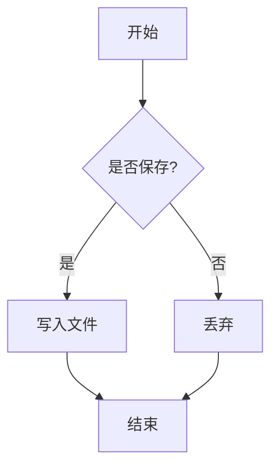
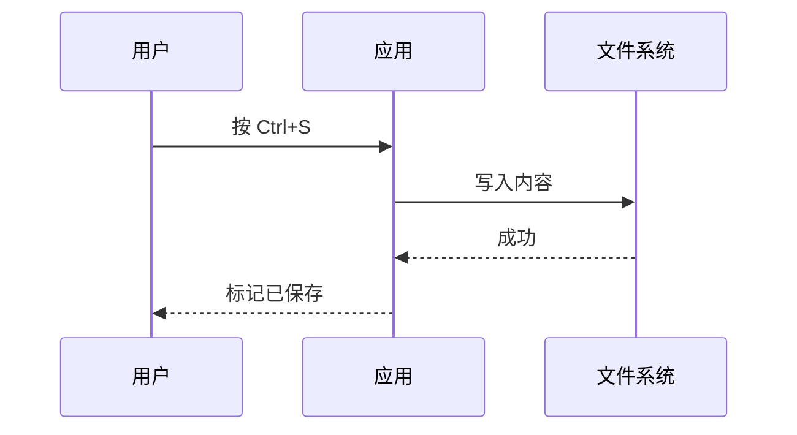

# Markdown 格式验收样例

> 本文件用于验收编辑器对 CommonMark / GFM / 扩展语法的完整渲染。

## 1. 基础语法

### 1.1 强调与文本

这是 **加粗**、*斜体*、***加粗斜体***、~~删除线~~，以及 `行内代码`。

自动链接：https://www.example.com

[普通链接](https://www.example.com)


### 1.2 列表

无序列表：

- 苹果
- 香蕉
  - 子项
- 橙子

有序列表：

1. 第一步
2. 第二步
3. 第三步

任务列表：

- [x] 已完成任务
- [ ] 未完成任务
- [ ] 进行中

### 1.3 引用与分隔线

> 这是一段引用。
>
> 多行引用示例。

---

## 2. 表格（GFM）

| 名称 | 类型 | 说明 |
| --- | --- | --- |
| 标题 | string | 文档标题 |
| 数量 | number | 条目数量 |
| 启用 | boolean | 是否启用 |

## 3. 代码高亮

```javascript
function greet(name) {
  const msg = `Hello, ${name}!`
  console.log(msg)
  return msg.length
}
```

```python
def fib(n):
    a, b = 0, 1
    for _ in range(n):
        a, b = b, a + b
    return a
```

## 4. 数学公式（KaTeX）

行内公式：$E = mc^2$ 与 $\int_0^1 x^2 \, dx = \frac{1}{3}$。

块级公式：

$$
\frac{\partial}{\partial t} \left( \rho \mathbf{v} \right) + \nabla \cdot \left( \rho \mathbf{v} \mathbf{v} \right) = -\nabla p + \mu \nabla^2 \mathbf{v}
$$

## 5. 图表（Mermaid）

流程图：



时序图：



## 6. 脚注[^1] 与定义

这里有一个脚注引用。[^note]

## 7. HTML 透传

<div style="padding:8px;border:1px solid #4f8cff;border-radius:6px;color:#4f8cff">
这是一段通过 HTML 原始标签渲染的内容。
</div>

## 8. Emoji 与特殊字符

支持原生 emoji 🚀 📝 ✅ 直接显示。

[^1]: 这是第一个脚注的内容。
[^note]: 这是附加说明脚注。
