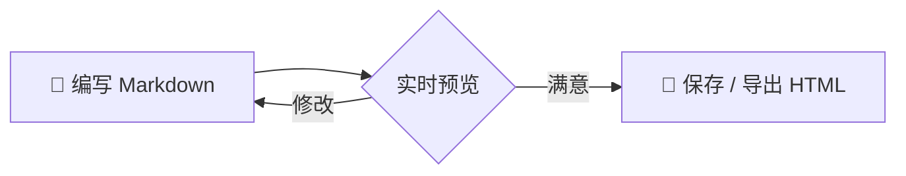
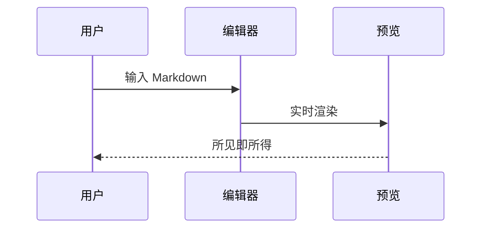

# 👋 欢迎使用 墨览YiQi@MD-Editor-千问办公-Qwen3.8-Max

> 一款**美观**、**全功能**、**可离线使用**的 Windows Markdown 编辑器。
> 左侧编辑、右侧实时预览，所见即所得。✨

::: tip 快速上手
- 顶部**多标签页**：`Ctrl+N` 新建标签、`Ctrl+Tab` 切换、`Ctrl+W` 关闭，可同时编辑多个文档
- `Ctrl+O` 打开文档，`Ctrl+S` 保存，`Ctrl+E` 导出独立 HTML
- 顶部工具栏可一键插入标题、表格、代码块、公式、Mermaid 图
- 右上角可切换 **编辑 / 分屏 / 预览** 三种视图与明暗主题
:::

---

## ✨ 基础语法

支持 **加粗**、*斜体*、~~删除线~~、==高亮标记==、`行内代码`、[超链接](https://qwenwork.cn)、上标^TM^、下标~H2O~。

### 引用与列表

> 千里之行，始于足下。
> —— 《道德经》

1. 有序列表第一项
2. 有序列表第二项
   - 嵌套无序列表
   - 支持多级缩进

- [x] 已完成的任务
- [ ] 待办任务（点击工具栏可插入）

### 表格（GFM）

| 功能 | 支持情况 | 说明 |
| :--- | :---: | ---: |
| GFM 表格 / 任务列表 | ✅ | 完整支持 |
| KaTeX 数学公式 | ✅ | 含 mhchem 化学式 |
| Mermaid 图表 | ✅ | 流程图 / 时序图 / 甘特图 |
| 脚注 / 定义列表 / 缩写 | ✅ | 完整支持 |

---

## 🔢 数学公式（KaTeX）

行内公式：质能方程 $E = mc^2$，欧拉公式 $e^{i\pi} + 1 = 0$。

块级公式：

$$
\int_{-\infty}^{\infty} e^{-x^2} \, dx = \sqrt{\pi}
$$

$$
\mathbf{X} = \begin{pmatrix} x_{11} & x_{12} \\ x_{21} & x_{22} \end{pmatrix}, \quad
\sum_{n=1}^{\infty} \frac{1}{n^2} = \frac{\pi^2}{6}
$$

化学方程式（mhchem）：$\ce{2H2 + O2 ->[点燃] 2H2O}$

---

## 🧜 Mermaid 图表





---

## 💻 代码高亮

```python
def greet(name: str) -> str:
    """向用户问好"""
    return f"Hello, {name}! 欢迎使用 YiQi@MD-Editor 🎉"

if __name__ == "__main__":
    print(greet("World"))
```

```javascript
const editor = {
  name: "YiQi@MD-Editor",
  version: "1.0.0",
  features: ["GFM", "KaTeX", "Mermaid", "Emoji 😄"],
};
console.log(JSON.stringify(editor, null, 2));
```

```json
{ "engine": "WebView2", "renderer": "markdown-it", "offline": true }
```

---

## 🗒️ 脚注 / 定义列表 / 缩写

Markdown 是一种轻量级标记语言[^1]，由 John Gruber 于 2004 年创建[^2]。

[^1]: 文件扩展名通常为 `.md` 或 `.markdown`。
[^2]: 详见 <https://daringfireball.net/projects/markdown/>。

Markdown
: 一种轻量级标记语言

GFM
: GitHub Flavored Markdown，GitHub 风格的 Markdown 扩展

*[GFM]: GitHub Flavored Markdown
*[HTML]: HyperText Markup Language

导出为 HTML 后即可在浏览器中查看完整效果。

---

## 📦 容器块（Admonition）

::: note 笔记
容器块适合用来做笔记、提示与警告说明。
:::

::: warning 注意
删除文件前请二次确认，数据无价。
:::

::: danger 危险
请勿在生产环境直接执行未验证的脚本！
:::

---

## 🎨 更多细节

- Emoji 短代码：:rocket: :tada: :sparkles: :bulb: :heart:
- 分割线、[x] 任务框、缩写悬浮提示均已支持
- 点击预览区图片可放大查看；代码块右上角可一键复制

---

> 用 **YiQi@MD-Editor**，让书写成为一种享受。
> © 2026 YiQi · Powered by 千问办公 Qwen3.8-Max
