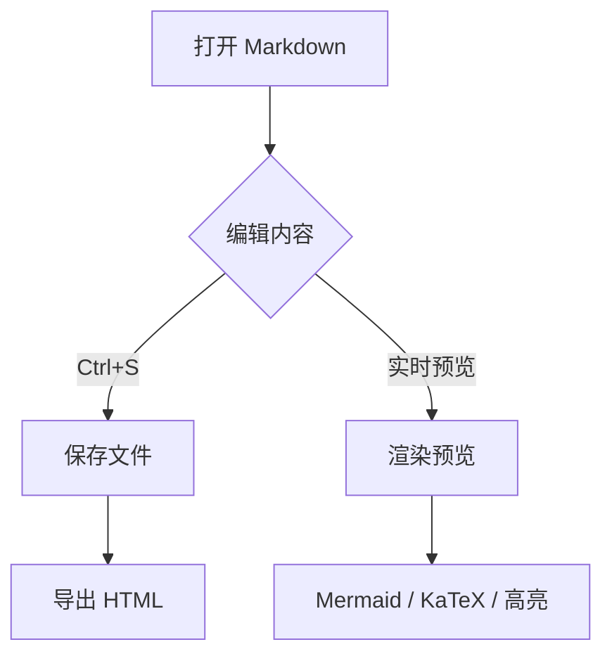
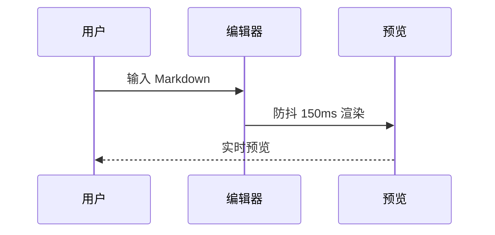

# YiQi@MD-Editor-wb-KimiK3 测试样例

> 本文件用于 QA 验证「YiQi@MD-Editor-wb-KimiK3 v1.0.0」Markdown 编辑器的全部渲染能力。

## 一、标题层级

# 一级标题 H1
## 二级标题 H2
### 三级标题 H3
#### 四级标题 H4
##### 五级标题 H5
###### 六级标题 H6

## 二、文本样式

这是**粗体**、*斜体*、***粗斜体***、~~删除线~~、==高亮标记==、++插入文本++。

下标示例：H~2~O 是水的化学式；上标示例：2^10^ = 1024，E = mc^2^。

HTML 是一种标记语言。[^note1]

[^note1]: 这是脚注示例：Markdown 把文本转换为 HTML。

## 三、列表

### 无序嵌套列表

- 一级条目 A
  - 二级条目 A1
    - 三级条目 A1a
  - 二级条目 A2
- 一级条目 B

### 有序嵌套列表

1. 第一步
   1. 子步骤 1.1
   2. 子步骤 1.2
2. 第二步

### 任务列表

- [x] 已完成：项目初始化
- [x] 已完成：渲染管线
- [ ] 未完成：性能优化
- [ ] 未完成：国际化

## 四、表格

| 功能 | 状态 | 负责人 | 备注 |
|:-----|:----:|-------:|:-----|
| 编辑区 | ✅ | 寇豆码 | 等宽字体 |
| 预览渲染 | ✅ | 寇豆码 | 防抖 150ms |
| Mermaid 图表 | ✅ | 寇豆码 | 失败显示源码 |
| 一个特别特别特别长的列内容用于测试表格横向滚动包裹是否正常生效 | ✅ | 寇豆码 | 滚动 |

## 五、代码块

```python
def fibonacci(n: int) -> list[int]:
    """生成斐波那契数列前 n 项。"""
    seq = [0, 1]
    while len(seq) < n:
        seq.append(seq[-1] + seq[-2])
    return seq[:n]

if __name__ == "__main__":
    print(fibonacci(10))
```

```javascript
const debounce = (fn, ms = 150) => {
  let timer = null;
  return (...args) => {
    clearTimeout(timer);
    timer = setTimeout(() => fn(...args), ms);
  };
};
```

```
这是一段无语言标注的代码块，应自动检测语言。
curl -X POST https://api.example.com/v1/chat -d '{"msg": "hi"}'
```

行内代码：`const x = 42;` 与 `pip install pywebview`。

## 六、数学公式

行内公式：质能方程 $E = mc^2$，以及欧拉恒等式 $e^{i\pi} + 1 = 0$。

块级公式：

$$\sum_{i=1}^{n} i = \frac{n(n+1)}{2}$$

$$\int_{-\infty}^{+\infty} e^{-x^2} \, dx = \sqrt{\pi}$$

## 七、Mermaid 图表





这是一段故意写错的 mermaid，用于验证失败时不崩溃并显示源码：

```mermaid
flowchart TD
    A[缺少结束括号 --> B
    C -->> D{{{
```

## 八、引用与分割线

> 学而不思则罔，思而不学则殆。
>
> ——《论语》

> 多层引用示例
>> 第二层引用
>>> 第三层引用

---

## 九、Emoji 与符号

笑脸 :smile: 火箭 :rocket: 星星 :star: 咖啡 :coffee: 完成 :white_check_mark:

## 十、缩写与定义列表

*[HTML]: HyperText Markup Language，超文本标记语言
*[CSS]: Cascading Style Sheets，层叠样式表

HTML 和 CSS 是前端基础（鼠标悬停缩写查看定义）。

术语 1
:   定义 1 的内容。

术语 2
:   定义 2 的第一段。
:   定义 2 的第二段。

## 十一、链接与图片

- 外部链接：[Markdown 官方文档](https://daringfireball.net/projects/markdown/)
- 内部锚点：[回到标题层级](#二、标题层级)
- 图片占位（相对路径，以 md 文件所在目录为基准）：


## 十二、目录标记（可选）

下方由 markdown-it-toc-done-right 处理 `[toc]` 标记：

[toc]

---

*测试样例结束 —— YiQi@MD-Editor-wb-KimiK3 v1.0.0 · 一览无遗*
